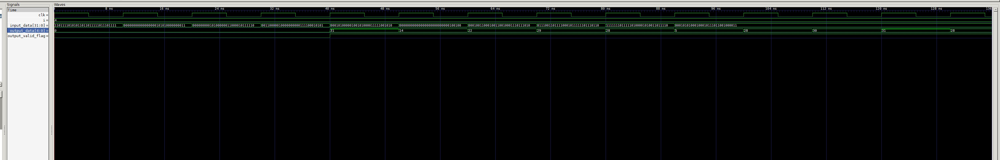

# high-bit-search
Домашнее задание №1 по курсу "Системотехника ЭВС"

Студент: Кутаев К.С.

Преподаватель: Орлов А.О.

# Задание
```
Реализовать модуль, который находит позицию старшего единичного бита в входном числе. Пример – вход 8’b00100100, выход – 3’d5.
а) Продемонстрировать, каким образом полученное решение масштабируется при неограниченном росте размерности входа (Достаточно показать на примере входа 32 или 64 бита). Данные поступают каждый такт.
б) Реализовать модуль, где ширина входных данных будет задаваться как параметр.
```

# Результаты

Значение подается на выход с задержкой в несколько тактов, которая зависит от ширины входных данных

Ширина данных 8 бит


Ширина данных 16 бит


Ширина данных 32 бита


Ширина данных 64 бита


Ширина данных задается через параметр 

Testbench


Source code
